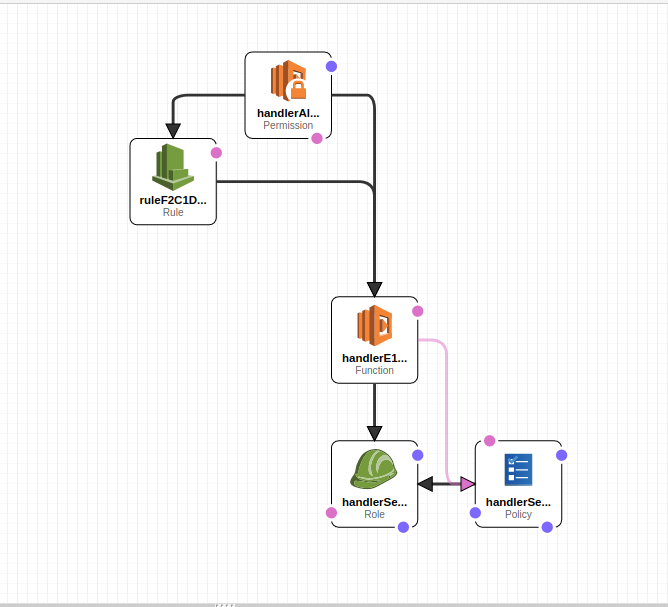

# NightyNight!

Do you have a EC2 instance that you only need during certain hours of the day? Do you want to reduce it's cost? How about just stopping it every night?

That's the NightyNight construct. It's very simple. Give it an `instanceId` and it will create a Lambda and a CloudWatch Event Rule to fire the lambda at a specific time of day. If the instance is running, it's stopped.


# This is a pre-release!

This is a quick first-draft. All the options that will likely need to be added to accommodate a large
number of use-cases are still needed. If you'd like to make requests or help update this construct, please
open an [Issue](https://github.com/mbonig/nightynight/issues) or a [PR](https://github.com/mbonig/cicd-spa-website/pulls).

# What is creates



* A Rule that will, on a given schedule, fire a lambda. 
* A Lambda with permissions to describe ec2 instances. It will read the instance by the given `instanceId` and then stop the instance if it's in a running state.

# Example:

```typescript
import {NightyNightForEc2} from "./ec2";

export class NightyNightStack extends Stack {

  constructor(scope: Construct, id: string, props: StackProps) {
    super(scope, id, props);

    // The code that defines your stack goes here
    new NightyNightForEc2(this, 'nighty-night', {instanceId: 'i-123123123123'});
  }
}

```

This will stop the instance with id `i-123123123123` at (the default) 4am GMT.

# API Doc

See the [API Docs](./API.md) for more info.

## Contributing

Please open Pull Requests and Issues on the [Github Repo](https://github.com/mbonig/nightynight).

## License

MIT
